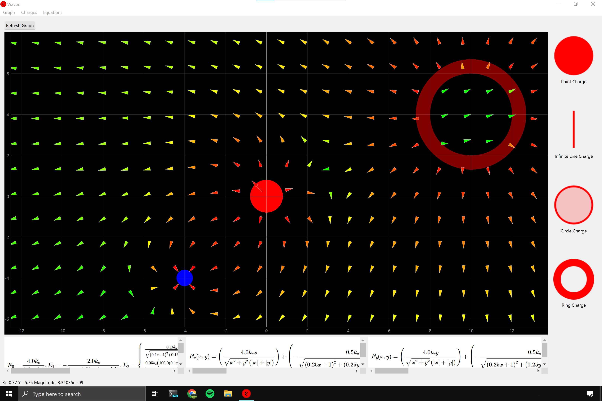

# Waveϵ

#### Electric field simulation at the wave of your hand

---

## Installation

Installing Waveϵ on your machine can be done in just three easy steps.

1. Download the code: `git clone git@github.com:PHYS-495-Jasper-Chris/Wavee.git`
2. Install dependencies: `pip install -r requirements.txt`
3. Execute code: `python src/main.py`

Note: you can manually install the requirements using the following. However this is not recommended unless installation using `requirements.txt` has failed.

```
pip install PyQt6
pip install sympy
pip install pyqtgraph
pip install PyQt6-WebEngine
```

---

## Overview


Waveϵ is a GUI application designed to simulate electric fields in 2D. This program allows users to drag and drop charged objects into a test plane and view the electric field. This includes: visually observing the electric field vector graph arrows, formula to calculate the electric field at any point, and an exact value of the magnitude at the position of the mouse within the test plane.

The application has four main windows which the user will interact with:

1. **Test Plane:** The test plane is the main graphic window which shows where each charged point is as well as the vector field. The user can interact with this window using the mouse to zoom or pan the view. This is where the user drags in charged objects.

2. **Drag and Drop:** The drag and drop column has 4 charge objects the user can drag into the main window. In descending order they are: point charge, line charge, circle charge and ring charge.

3. **Equations View:** The equations view area shows a generic equation which can be used to calculate the magnitude of the magnetic field due to each component. As well as the net magnetic field for the x and y component respectively.

4. **Settings:** The settings menus allows the user more control over the application including: undo and redo the placement of charges, changing the number of electric field arrows that get drawn, rounding digits for the equations.


## More about Waveϵ

We created Waveϵ as our senior design project for the University of Southern California Physics/Computer Science Senior Design project (PHYS 495). This project is intended to help students visualize the concepts covered in Electricity and Magnetism classes. Getting tools like this into the hands of students allow for a better visual understanding of how electric forces work at an introductory level.

We would like to thank our project advisor Aiichiro Nakano as well as the USC Physics department for their support. This project would not have been possible otherwise.


